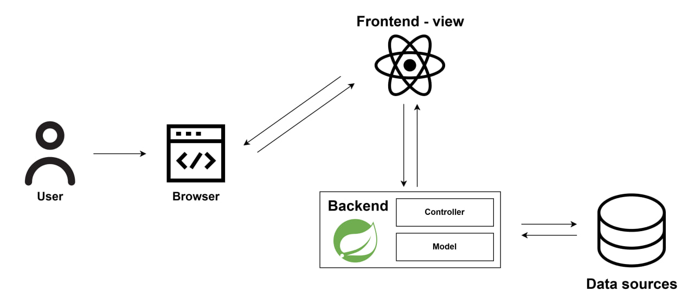

# BicoChat

> An instant messaging app that allows users to send real-time messages, create custom groups, and easily manage their chats through search and filters.

## Group Components:

- Cavaleri Matteo - 875050
- Gargiulo Elio - 869184
- Gherardi Marco - 869138
- Monti Lorenzo - 869960
- Oltolini Edoardo - 869124

## Architecture

The architecture of the solution involves the use of the MVC architectural pattern. The components participating are therefore the following:

* **User**: The user who wants to use the application.
* **Browser**: The means that enables the visualization of the frontend.
* **Frontend (View)**: Dynamic web page developed in React.
* **Backend**: Developed in Java/Spring Boot, it represents two components:
    * **Controller**: Manages and coordinates the interaction between the View and the Model.
    * **Model**: Represents the business logic of the application and is responsible for interacting with the DB.
* **Data sources**: Set of "Database" technologies that allow the management of application data (user data, chat data, authentication).

